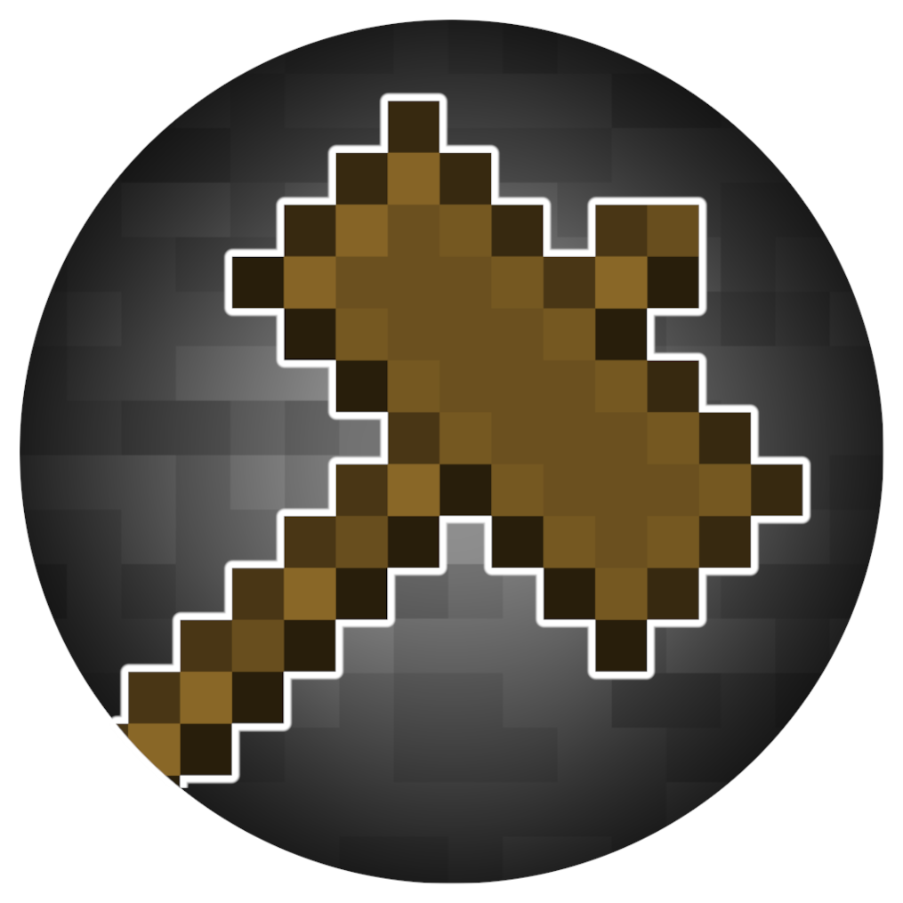

<h1 align="center">
	Minecraft 3D Model Importer
</h1>

A Forge mod built for Minecraft Java 1.19.4 that allows you to import, transform, and place 3D Models into your world.

Models are automatically converted into a voxelized, blocky representations complete with textures and color matching. Players can scale, rotate, and position models in-game using intuitive keyboard and mouse controls, or through commands for more fine-tuned adjustments. 

This mod supports .obj and .stl file formats, and provides a real-time preview of the model as it is transformed and placed within the world.

<h2>How to Install/Compile</h2>

To install this mod, simply copy the <code>MC-3D-Model-Importer.jar</code> file into the mods folder of your Minecraft directory. Alternatively, you can directly download the file from this <a href="https://drive.google.com/uc?export=download&id=1Vnnlh0lzMOiZfB6nik4ipL2DYsyTqjYl">link</a>.

If you would like to compile the .jar file yourself, navigate to the root directory of the project and run <code>gradlew build</code> from the command line.

<h2>How to Use</h2>
    <h3>Loading a Model</h3>
    
Upon launching the game, a <code>models</code> folder will be created in your Minecraft directory. Place your 3D models and textures in this folder.

    
To load a model in-game:

    <ol>
        <li>Open your world.</li>
        <li>Run the command: <code>/model load &lt;filename&gt;</code>. The mod will list all valid filenames in your <code>models</code> folder.</li>
    </ol>

<h3>Manipulating Models with the Model Hammer</h3>

The <strong>Model Hammer</strong> is your primary tool for interacting with models in the game. You can perform various transformations (scaling, rotating, and moving) with keyboard and mouse controls while holding the hammer.

<ul>
	<li><strong>Placing the Model</strong>: Right-click with the hammer to place the model where you want it.</li>
	<li><strong>Transformations</strong>: Press the following keys to change transformation modes:
		<ul>
			<li><strong>S</strong>: Scale</li>
			<li><strong>R</strong>: Rotate</li>
			<li><strong>M</strong>: Move</li>
		</ul>
		Then, scroll your mouse wheel to apply the transformation.
	</li>
	<li><strong>Axis Selection</strong>: Choose which axis to manipulate by pressing the corresponding keys:
		<ul>
			<li><strong>X</strong>: X-axis</li>
			<li><strong>Y</strong>: Y-axis</li>
			<li><strong>Z</strong>: Z-axis</li>
		</ul>
	</li>
	<li><strong>Placement Controls</strong>:
		<ul>
			<li>Press <strong>P</strong> to place the model.</li>
			<li>Press <strong>U</strong> to unplace the model.</li>
		</ul>
		These key bindings are configurable in the settings menu.
	</li>
</ul>

<h3>Manipulating Models via Commands</h3>

You can also manipulate models using in-game commands. The <code>/model</code> command offers several subcommands for loading, transforming, and adjusting models.

<h4>/model load &lt;filename&gt;</h4>

Loads a model from the <code>models</code> folder. Supported formats: <code>.stl</code> and <code>.obj</code>.

<h4>/model place</h4>

Places the currently loaded model at the player's position.

<h4>/model undo</h4>

Undoes the last model placement action.

<h4>/model scale ...</h4>
<ul>
	<li><code>/model scale &lt;scale&gt;</code>: Scales the model uniformly in all dimensions by the given number.</li>
	<li><code>/model scale &lt;x-scale&gt; &lt;y-scale&gt; &lt;z-scale&gt;</code>: Scales the model independently along each axis.</li>
	<li><code>/model scale &lt;axis&gt; &lt;scale&gt;</code>: Scales the model along the specified axis (<code>x</code>, <code>y</code>, or <code>z</code>).</li>
</ul>

<h4>/model rotate ...</h4>
<ul>
	<li><code>/model rotate &lt;x-angle&gt; &lt;y-angle&gt; &lt;z-angle&gt;</code>: Rotates the model by the given angles around the X, Y, and Z axes.</li>
	<li><code>/model rotate &lt;axis&gt; &lt;angle&gt;</code>: Rotates the model around the specified axis by the given angle.</li>
</ul>

<h4>/model move &lt;distance&gt; [&lt;direction&gt;]</h4>

Moves the model by the specified distance. If no direction is specified, the model will move in the direction the player is facing.

Valid directions: <code>up</code>, <code>down</code>, <code>north</code>, <code>east</code>, <code>south</code>, <code>west</code>.

<h3>Changing Model Appearance</h3>

By default, models appear as semi-transparent white bounding boxes to minimize lag. Press <strong>V</strong> to toggle between this view and a more detailed block preview of the model.
